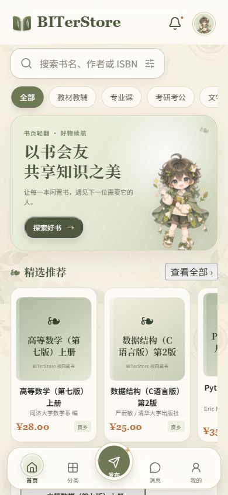
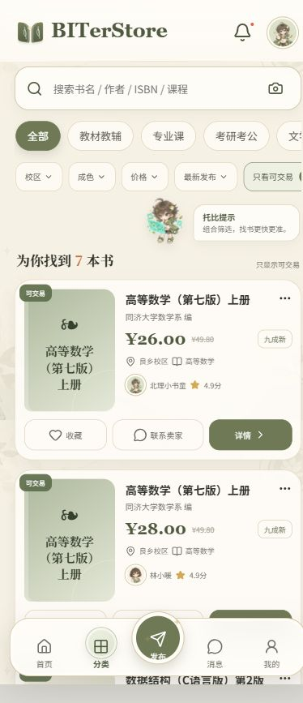
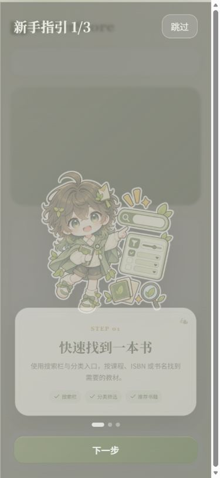
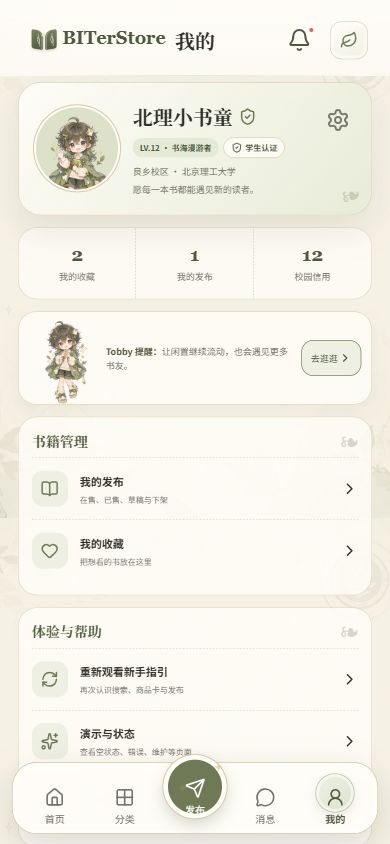
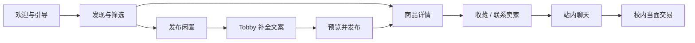
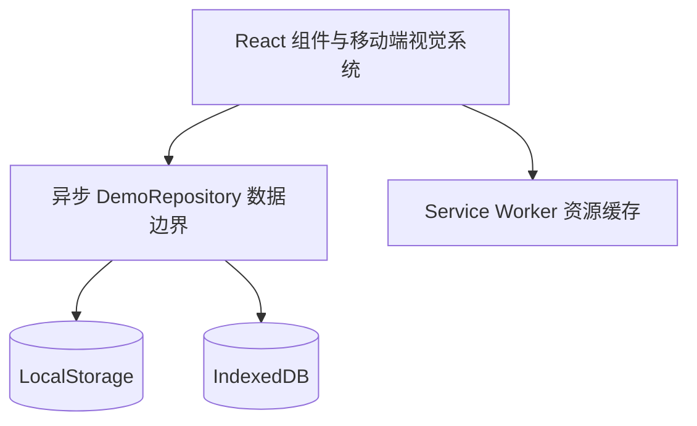

<div align="center">
  
  <h1>BITerStore</h1>
  <p><strong>让每一本书，继续被需要。</strong></p>
  <p>面向北京理工大学校园场景的移动端二手书交互原型</p>

  <p>
    
    
    
    
    <a href="./LICENSE"></a>
  </p>

  <p>
    <a href="https://biterstore-mobile.studentop.chatgpt.site"><strong>部署预览</strong></a>
    ·
    <a href="#-快速开始"><strong>本地运行</strong></a>
    ·
    <a href="#-项目结构"><strong>项目结构</strong></a>
  </p>
</div>


> [!NOTE]
> 部署预览目前保留项目所有者访问门禁。公开访客可以通过下方截图了解完整界面，或在本地运行全部交互。

## 🌿 项目愿景

教材不该在一次课程结束后就被遗忘。

BITerStore 希望把校园里的闲置书籍重新连接起来：同学可以按课程、成色、校区和价格找到需要的书，也可以快速发布旧书、联系卖家并约定校内当面交易。产品以温和的纸张质感、低饱和鼠尾草绿和书童角色 **Tobby**，降低传统二手平台的交易感，保留校园社区应有的信任与温度。

这个仓库不是把设计稿贴成网页。页面中的标题、卡片、筛选、表单、聊天、按钮、状态和导航均由真实 DOM 与可交互组件实现。

## ✨ 体验亮点

| 发现好书 | 发布闲置 | 校园沟通 | 状态完整 |
| :--- | :--- | :--- | :--- |
| 关键词、分类、成色、校区、价格与排序组合筛选 | 图片上传、草稿恢复、表单校验、预览确认 | 通知分类、商品分享、文字与图片消息演示 | Loading、Empty、Network、Maintenance、404 等完整反馈 |
| 收藏、热榜、商品详情与可交易状态 | Tobby 本地规则模拟识别并自动补全文案 | 未读状态和校内当面交易安全提示 | 首次资源初始化、离线缓存与平滑路由动画 |

## 📱 移动端画廊

<div align="center">
  
  &nbsp;
  
  &nbsp;
  
  &nbsp;
  
</div>

<p align="center"><sub>以 390px 为主要验收宽度，同时覆盖 360px 与 430px；桌面访问时显示居中的移动应用画布。</sub></p>

## 🧭 交互闭环



主要路由：

| 路由 | 内容 |
| :--- | :--- |
| `/` · `/onboarding` | 首次欢迎、品牌介绍与三步引导 |
| `/home` · `/category` | 首页、搜索、分类与组合筛选 |
| `/books/:id` | 商品信息、卖家、收藏与联系入口 |
| `/publish` | 上传、识别模拟、草稿、表单、预览与发布 |
| `/messages` · `/messages/:id` | 通知详情、会话列表与聊天 |
| `/profile` · `/favorites` · `/my-listings` | 个人中心、收藏和发布管理 |
| `/states/:type` | 空态、错误、维护、不可用与成功状态 |

## 🧩 技术设计



- **React + TypeScript**：真实组件、表单、导航与状态管理。
- **自定义 CSS**：不使用通用 UI 框架，保留原创纸张质感和品牌层级。
- **DemoRepository**：页面不直接耦合浏览器存储，后续可以整体替换成真实 API。
- **LocalStorage + IndexedDB**：保存引导、收藏、筛选、草稿、消息及压缩后的上传图片。
- **Service Worker**：首次启动预热 Tobby 与 UI 素材，后续访问直接命中缓存。
- **确定性演示数据**：所有延迟和状态可复现，不会随机破坏正常流程。

## 🎨 视觉语言

| Token | 色值 | 用途 |
| :--- | :---: | :--- |
| Primary Sage | `#6F7956` | 品牌主色、按钮与激活态 |
| Dark Olive | `#4F5940` | 标题、Logo 与重要信息 |
| Cream Background | `#F7F4EA` | 应用背景与纸张氛围 |
| Warm Border | `#D5C7A7` | 卡片边框与低饱和分隔 |
| Price Accent | `#C56E3B` | 价格与交易重点 |
| Holographic Aqua | `#78D8C6` | 焦点与少量高光反馈 |

## 🚀 快速开始

环境要求：**Node.js 22.13+**。

```bash
git clone https://github.com/AnonymousUser443/BITerStore.git
cd BITerStore/web
npm install
npm run dev
```

浏览器打开 <http://localhost:3000>。

质量检查：

```bash
npm run lint
npm test
npm run build
```

Taro 双端客户端：

```bash
cd ../miniProgram
npm install
npm run dev:h5
# 或构建微信小程序
npm run build:weapp
```

微信开发者工具和自动化环境配置见 [`WEAPP_CODEX_AUTOMATION_SETUP.md`](./WEAPP_CODEX_AUTOMATION_SETUP.md)。旧 `web/` 在迁移期间继续作为视觉、交互和回滚基线。

当前锁定 Taro 4.2.1 的传递依赖仍有 npm audit 上游告警；H5 直接复用 `web/app/components/mobile-app.tsx` 与 Golden Reference CSS，生产入口约 357 KiB。它们不阻塞离线演示，但属于正式生产化前必须解决的升级与性能门禁；不要对 lockfile 执行不兼容的 `npm audit fix --force`。

## 🗂 项目结构

```text
BITerStore/
├─ Assets/                 # 原始设计参考与 Tobby 素材，不覆盖源文件
├─ docs/avatars/           # 开发团队头像素材
├─ qa-screenshots/         # 360 / 390 / 430px 浏览器验收截图
├─ miniProgram/            # Taro 4.2.1 微信小程序与 H5 双端客户端
├─ web/
│  ├─ app/
│  │  ├─ components/       # 页面与通用移动组件
│  │  └─ lib/              # 类型、种子数据、仓库与本地图片存储
│  ├─ public/assets/       # WebP 响应式角色与背景资源
│  ├─ public/sw.js         # 首次资源包缓存
│  └─ package.json
├─ LICENSE                 # Apache License 2.0
├─ TODO.md                 # 持续开发与验收记录
└─ README.md
```

## 🧪 当前边界

BITerStore 目前是纯前端高保真交互原型，默认用户已经完成北理校园身份认证。项目暂不连接真实后端、支付、短信、地图、内容审核或 AI 服务；所有外部能力都通过可替换的异步接口进行本地模拟。

## 📄 开源许可

本项目采用 [Apache License 2.0](./LICENSE) 开源。你可以在遵守许可证条款并保留版权与许可声明的前提下使用、修改和分发本项目。

## 👥 开发团队

<table align="center">
  <tr>
    <td align="center" width="50%">
      
      <br />
      <strong>StudentOP Aiden</strong>
      <br />
      <sub>Frontend Developer · 前端开发</sub>
      <br />
      <sub>移动端 UI、交互体验与前端工程</sub>
    </td>
    <td align="center" width="50%">
      
      <br />
      <strong>Smal_Young</strong>
      <br />
      <sub>Backend Developer · 后端开发</sub>
      <br />
      <sub>杨景博 · 后端仓库筹备中</sub>
    </td>
  </tr>
</table>

---

<div align="center">
  
  <p><strong>书页轻翻 · 好物续航</strong></p>
  <p><sub>Made for the BIT campus community.</sub></p>
</div>
