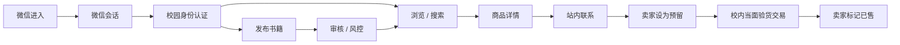
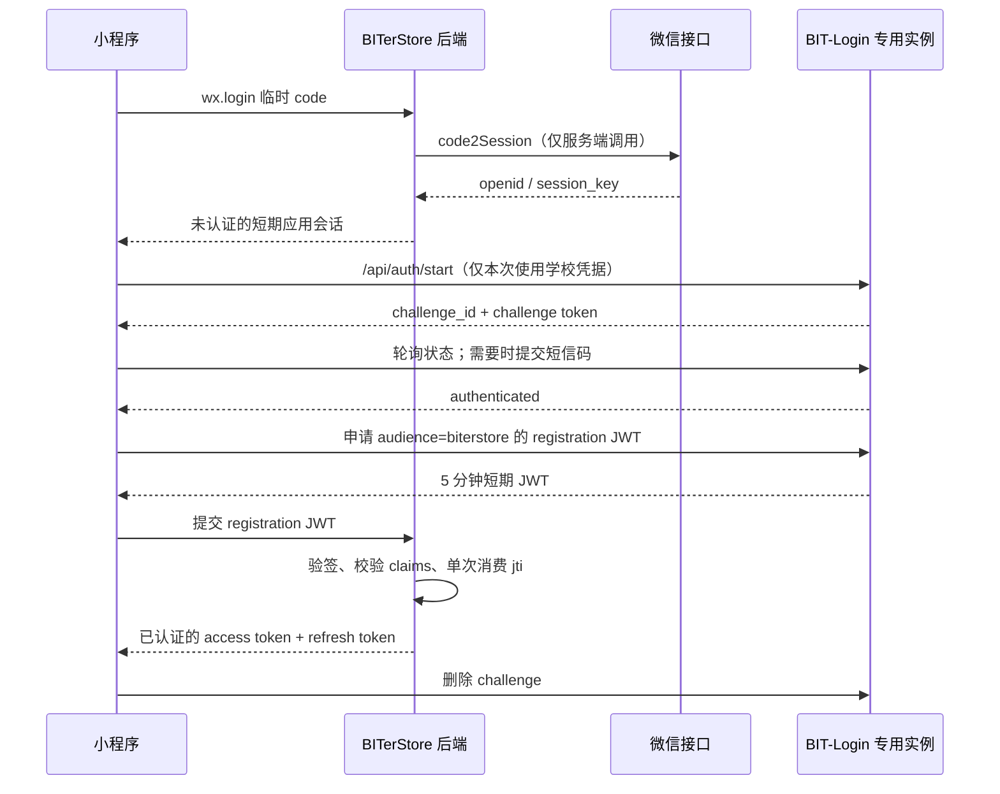
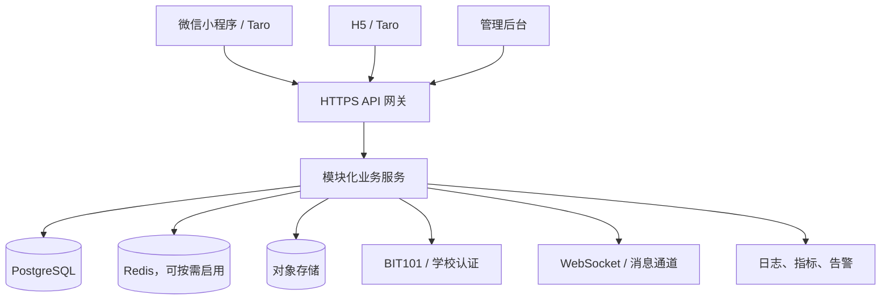

# BITerStore 校内二手书交易平台整体实施计划

> 当前决策（2026-08-26）：正式重启 Taro 双端迁移，以 `miniProgram/` 作为微信小程序与 H5 的唯一新客户端；现有 `web/` H5 保留为 Golden Reference 和回滚版本。

> 文档版本：v0.1
> 制定日期：2026-08-25
> 当前阶段：纯前端交互原型已完成，准备进入产品验证、认证对接与工程化实施阶段

## 1. 结论先行

BITerStore 第一阶段应被定义为：**仅面向北京理工大学已认证成员、以信息撮合和校内当面交易为核心、不承接线上支付的二手书平台**。

建议采用以下路线：

1. 保留当前 `web/` React 原型，作为产品需求、视觉规范和交互验收基线。
2. 正式客户端新建 **Taro + React + TypeScript** 工程，优先发布微信小程序，同时保留编译 H5 的能力。
3. 新建独立后端，采用“模块化单体”而非一开始拆微服务；共用一套 API 服务于小程序和 H5。
4. 校园身份认证必须通过 BIT101/学校授权的认证服务完成；BITerStore 不保存学校统一身份认证密码，也不自行模拟或抓取学校登录流程。
5. MVP 不做在线支付、物流、评价体系、AI 识别和复杂推荐。先验证“有书可找、发布够快、能安全联系、交易能闭环”。

推荐的最终形态不是简单的 H5 套壳。`web-view` 可以用于早期内测或承载少量辅助页面，但不应作为小程序首页、发布、聊天等主流程的长期方案。

## 2. 已有资产与现状判断

### 2.1 当前前端

现有仓库已经具备一个完成度较高的 React 19 + TypeScript 移动端原型，主要能力包括：

- 首页、分类、搜索、组合筛选和商品详情；
- 图片上传、发布、草稿恢复和发布预览；
- 收藏、我的发布、消息中心和聊天演示；
- Loading、Empty、Error、Maintenance、404 等完整状态；
- 360px、390px、430px 移动端适配；
- `DemoRepository` 数据边界、本地持久化、单元测试和 Service Worker；
- 已建立的品牌、Design Tokens、Tobby 角色和视觉资产。

它目前仍是**纯前端演示系统**：数据主要在 LocalStorage/IndexedDB 中，默认用户已认证，没有真实账户、后端、内容审核、实时聊天和生产安全能力。

### 2.2 BIT101 与 BIT-Login 可复用内容

BIT101 的公开前端和 Go 后端展示了两代相关流程：

- 旧流程：WebVPN 初始化、统一身份验证、邮件验证、注册，登录后通过 JWT 形式的 `fake-cookie` 鉴权；
- 较新前端：调用独立登录服务，以 challenge、短期 access token 和短信二次验证完成教务相关身份认证。

`BIT101-dev/BIT-Login` 当前主分支则已经提供较完整的 Kotlin/Ktor 认证服务：异步 challenge、短信二次验证、短期 session，以及面向指定 `audience` 签发的 Ed25519 注册 JWT。它可以作为 BITerStore 的校园认证适配器，优先使用 `/api/auth/*` 与 `/registration-token`，无需复制旧版 WebVPN 实现。

但它不是学校官方 OAuth/OIDC 服务，生产使用前仍需完成以下确认和加固：

- 当前仓库根目录未发现明确的 `LICENSE` 文件，公开可读不等于允许复制、修改和部署；应请维护者补充许可证或给予书面许可；
- 默认 CORS 配置使用 `anyHost()`，生产实例必须改为域名白名单；
- 服务同时暴露成绩、课程、Cookie 等接口，BITerStore 专用实例应通过代码或网关只开放 `/api/auth/*` 和健康检查；
- 确认部署责任、上游认证变化、故障联络、限流以及用户凭据处理披露。

BIT101 前后端采用 AGPL-3.0，当前 BITerStore 前端采用 Apache-2.0。可以参考其公开设计和文档；若复制、修改或部署其代码，必须先做许可证兼容性评估，不能默认保持 BITerStore 原有许可不变。

## 3. 客户端方案选择

| 方案 | 研发速度 | 小程序体验 | 复用现有前端 | 长期维护 | 结论 |
| --- | --- | --- | --- | --- | --- |
| 继续现有 H5 | 最快 | 用户需从浏览器进入 | 最高 | 双端能力弱 | 可用于封闭内测 |
| 小程序 `web-view` 套 H5 | 较快 | 登录、导航、分享、文件能力存在割裂 | 高 | 容易形成平台边界问题 | 只作临时过渡 |
| 原生微信小程序 | 较慢 | 最佳 | 很低 | 单端维护清晰 | 团队只做微信时可选 |
| Taro React：微信小程序 + H5 | 中等 | 接近原生 | 可复用 React 思维、类型和部分业务代码，不能直接复用 DOM 页面 | 一套业务核心支持两端 | **推荐** |

### 推荐落地方式

采用渐进迁移，而不是直接改造当前 `web/`：

```text
BITerStore/
├─ web/                 # 现有原型，继续作为 UI/交互基准与内测 H5
├─ clients/
│  └─ miniProgram/      # Taro React，输出 weapp 与 h5
├─ packages/
│  ├─ contracts/        # API DTO、状态枚举、校验规则
│  ├─ design-tokens/    # 色彩、字号、圆角、间距
│  └─ domain/           # 无平台依赖的业务逻辑
├─ server/              # 独立后端
├─ admin/               # 最小化治理后台
└─ docs/
```

迁移时可以复用：产品信息架构、文案、图片资产、Design Tokens、TypeScript 类型、种子数据和部分纯业务函数。不能预期直接复用：Next/Vinext 路由、浏览器 DOM 组件、LocalStorage/IndexedDB、Service Worker 和依赖浏览器 API 的 CSS/动画。

若团队必须在 4 周内让真实用户试用，可先发布 HTTPS H5 内测；但此阶段仍要使用真实后端，不能继续用本地演示数据。完成关键数据验证后再发布 Taro 小程序。

### 可采用的开源小程序框架

可以使用其他开源框架，但应该选择“维护活跃、许可证明确、团队技术栈匹配”的基础框架，不建议直接套一个来源不明的二手商城成品项目。

| 开源方案 | 主要技术 | 优点 | 对本项目的代价 | 建议 |
| --- | --- | --- | --- | --- |
| [Taro](https://github.com/NervJS/taro) | React/Vue、MIT | 支持微信小程序与 H5；与现有 React/TypeScript 团队最接近 | 仍需重写 DOM、路由和浏览器存储层 | **首选** |
| [uni-app](https://github.com/dcloudio/uni-app) | Vue、Apache-2.0 | 多端生态和插件丰富，上手资料多 | 团队需从 React 切到 Vue；现有组件复用更少 | 团队更熟 Vue 时选择 |
| [Mpx](https://github.com/didi/mpx) | 增强小程序 DSL | 小程序能力和性能优化较深入 | 社区规模与团队熟悉度需单独验证 | 有既有 Mpx 经验时选择 |
| [微信原生示例](https://github.com/wechat-miniprogram/miniprogram-demo) + 原生框架 | WXML/WXSS/JS/TS | 平台能力最直接、依赖最少 | H5 需要单独实现，现有 React 复用最低 | 确定只做微信小程序时选择 |

最终选型用一个 2 天 spike 决定：分别验证商品长列表、图片上传、登录 challenge、底部导航、分享和 360–430px 真机效果。若没有明显阻断项，沿用 Taro React，避免仅因“还有其他开源项目”而更换技术栈。

## 4. 产品范围

### 4.1 MVP 必须完成

- 校园身份认证、微信身份绑定、登录与注销；
- 浏览、关键词搜索、分类和校区筛选；
- 商品详情、收藏；
- 发布、编辑、下架、重新上架、标记预留/已售；
- 文本会话、未读数、系统通知；
- 举报商品/用户、拉黑、违规内容处置；
- 我的发布、我的收藏、会话和基础个人资料；
- 最小管理后台：用户、商品、举报、封禁、审计日志；
- 用户协议、隐私政策、交易安全提示、账号注销与数据删除入口；
- 监控、备份和基础运营指标。

### 4.2 MVP 明确不做

- 在线支付、担保交易、退款和平台抽成；
- 快递/跑腿履约；
- 竞价、复杂订单、优惠券、积分和会员体系；
- 公布手机号、精确宿舍或实时位置；
- 图片消息、语音、群聊和音视频；
- AI 自动识书、个性化推荐和复杂搜索集群；
- 扩展到数码、代购、票务等高风险品类。

### 4.3 核心业务闭环



## 5. 认证与账户设计

### 5.1 两类身份必须分开

- **微信身份**：用于识别当前小程序设备/微信用户和建立应用会话；`wx.login` 只能证明微信侧身份，不能证明其为北理学生。
- **校园身份**：用于授予“北理认证”资格，必须来自学校或 BIT101 明确授权的可信认证结果。

数据库中将两者绑定到一个 BITerStore 用户，而不是把学号直接当作主键。

### 5.2 确定方案：BIT-Login 注册 JWT

在取得使用许可后，部署 BITerStore 专用的 BIT-Login 实例，采用以下接口：

1. `POST /api/auth/start`：提交学号、统一认证密码和所需服务，创建 challenge；
2. `GET /api/auth/{challenge_id}`：轮询 `running / waiting_sms / authenticated / failed / expired`；
3. `POST /api/auth/{challenge_id}/sms`：需要时提交短信验证码；
4. `POST /api/auth/{challenge_id}/registration-token`：认证成功后，为 `audience=biterstore` 签发短期 Ed25519 JWT；
5. `DELETE /api/auth/{challenge_id}`：BITerStore 完成注册/绑定后立即销毁 challenge 和关联会话。

BITerStore 后端仅信任 registration token，不接收学校密码、短信码或教务 Cookie。它必须验证 JWT 的 Ed25519 签名、`iss`、`aud=biterstore`、`exp`、`iat`、`purpose=registration`、`sub` 和 `jti`，并将 `jti` 作为一次性凭证消费，防止重放。

BIT-Login 只用于证明校园身份，不调用或保存成绩、课表、学分等与交易无关的数据。学校邮箱验证码可作为认证服务长时间中断时的人工审核备选，但不得静默等同于完整统一身份认证。

### 5.3 推荐登录流程



### 5.4 最小化存储

建议仅保存：

- 内部 `user_id`；
- 微信 `openid`（如确有跨应用需求再评估 `unionid`）；
- 认证方 `issuer` 与不可逆/稳定的外部主体标识；
- 校园认证状态、认证时间、到期时间；
- 用户主动填写的昵称、头像、校区。

默认不保存：统一身份认证密码、WebVPN Cookie、短信验证码、教务 Cookie、成绩、课程表、身份证号。若业务确需保存学号，应先论证必要性，并做字段级加密、访问审计和展示脱敏。

## 6. 技术架构

### 6.1 总体结构



### 6.2 后端建议

第一阶段使用模块化单体：

- 推荐栈：团队熟悉 TypeScript 时使用 NestJS/Fastify；熟悉 Go 时使用 Gin。两者都可满足 MVP，团队能力比框架偏好更重要。
- API：REST；实时聊天使用 WebSocket。若早期部署环境不稳定，可先用 5–10 秒增量轮询。
- 数据库：PostgreSQL，作为唯一事实来源。
- 搜索：MVP 先使用 PostgreSQL 全文搜索/模糊匹配和规范化 ISBN；数据量或相关性出现瓶颈后再引入 Meilisearch。
- 缓存与限流：初期可用进程内限流；多实例或消息规模上升后启用 Redis。
- 图片：S3 兼容对象存储，客户端直传临时凭证/签名 URL，服务端记录元数据并执行格式、大小和内容检查。
- 校园认证：隔离部署 BIT-Login Ktor 服务；网关只允许必要认证路由，SQLite 放持久化加密磁盘，注册私钥独立保管。
- 部署：中国大陆 HTTPS 域名、自动化构建、数据库迁移、每日备份；正式上线前确认 ICP、校方和小程序主体/类目要求。

不要在 MVP 直接照搬 BIT101 的 PostgreSQL + Redis + Meilisearch + Gorse 全套部署；交易平台初期的数据规模不需要推荐系统，额外组件会显著增加运维成本。

## 7. 核心数据模型

| 实体 | 关键字段 |
| --- | --- |
| `users` | id、nickname、avatar、campus、status、created_at |
| `identities` | user_id、provider、external_subject、verified_at、expires_at |
| `wechat_accounts` | user_id、openid、unionid_nullable、last_login_at |
| `sessions` | user_id、refresh_token_hash、device、expires_at、revoked_at |
| `listings` | seller_id、title、isbn、author、category、condition、price、campus、description、status |
| `listing_images` | listing_id、object_key、sort_order、moderation_status |
| `favorites` | user_id、listing_id、created_at，联合唯一约束 |
| `conversations` | listing_id、buyer_id、seller_id、last_message_at |
| `messages` | conversation_id、sender_id、type、content、created_at、read_at |
| `reports` | reporter_id、target_type、target_id、reason、evidence、status |
| `blocks` | user_id、blocked_user_id、created_at |
| `moderation_actions` | operator_id、target、action、reason、created_at |
| `audit_logs` | actor、action、resource、request_id、created_at |

商品状态统一为：

```text
DRAFT → PENDING_REVIEW → ACTIVE → RESERVED → SOLD
                         ↘ OFF_SHELF
                         ↘ BLOCKED
```

关键约束：价格使用整数分；删除优先软删除；状态变更使用乐观锁；收藏、会话和幂等请求建立唯一约束；卖家不能联系或收藏自己的商品。

## 8. API 分组

```text
POST   /v1/auth/wechat/session
POST   /v1/auth/campus/start
POST   /v1/auth/campus/callback
POST   /v1/auth/refresh
POST   /v1/auth/logout
GET    /v1/me
PATCH  /v1/me
DELETE /v1/me

GET    /v1/listings
POST   /v1/listings
GET    /v1/listings/:id
PATCH  /v1/listings/:id
POST   /v1/listings/:id/state
POST   /v1/listings/:id/favorite
DELETE /v1/listings/:id/favorite

POST   /v1/uploads/presign
POST   /v1/uploads/:id/complete

GET    /v1/conversations
POST   /v1/conversations
GET    /v1/conversations/:id/messages
POST   /v1/conversations/:id/messages
POST   /v1/conversations/:id/read

POST   /v1/reports
POST   /v1/blocks/:userId
GET    /v1/notifications
```

所有写接口应具备：身份校验、对象级权限检查、输入校验、限流、幂等策略、结构化审计日志和统一错误码。前后端通过 OpenAPI 生成类型或共享 `contracts`，不手工维护两套接口类型。

## 9. 安全、隐私与平台治理

### 9.1 安全底线

- 全站 HTTPS，密钥通过部署环境管理，不进入 Git；
- access token 短期有效，refresh token 轮换并只存哈希；
- 小程序令牌通过授权头传输；H5 优先使用 `HttpOnly + Secure + SameSite` Cookie；
- 密码、学校 Cookie 和微信 `session_key` 不发给客户端、不写日志；
- 图片校验 MIME、扩展名、尺寸、容量，重新编码后再公开；
- 登录、发布、私信、举报均做分层限流和异常告警；
- 对越权、批量爬取、刷屏、SQL 注入、XSS、CSRF、SSRF、恶意文件上传做专项测试；
- 管理员启用强认证，所有处置动作留审计记录。
- BIT-Login 强制 HTTPS、来源白名单和速率限制；关闭或拦截成绩、Cookie、课程等无关路由；challenge 数据按最短期限清理。

### 9.2 隐私原则

依据最小必要原则，只收集完成功能所需信息；明确告知处理目的、保存期限和第三方共享情况；提供查阅、更正、注销和删除渠道。校园认证信息与公开资料分离，默认只展示“已认证”徽章，不公开学号、真实姓名、手机号或具体宿舍。

### 9.3 交易和内容治理

- 上线前由校方/法律顾问确认平台主体责任、用户协议和交易规则；
- 仅允许书籍，建立禁售清单：盗版、内部涉密材料、非法出版物、含个人信息的资料等；
- 商品详情明确“平台仅提供信息撮合，建议校内公共场所当面验书”；
- 举报入口必须在商品、用户和会话中可达；
- 建立举报受理时限、申诉、封禁、证据留存和紧急下架流程；
- 平台是否构成电子商务平台、实名核验和信息报送义务，应在公测前取得专业判断，不能仅因“不做支付”而忽略平台责任。

## 10. 管理后台与运营

管理后台不是上线后的附加项，MVP 至少需要：

- 待审核/被举报商品列表；
- 用户状态、认证状态和风险记录；
- 商品下架、用户禁言/封禁、申诉恢复；
- 举报工单流转和处置备注；
- 敏感操作二次确认和审计日志；
- 基础指标看板。

首批关注指标：

- 校园认证成功率、失败原因和耗时；
- 新用户首日发布率；
- 搜索有结果率、商品详情到发起会话转化率；
- 发布完成率和平均发布时间；
- 7/30 日有效商品数、预留率、已售率；
- 举报率、处置时长、封禁率；
- API 错误率、P95 延迟、消息到达率。

不要把注册量、PV 当成唯一成功指标。MVP 的北极星指标建议采用：**每周完成的有效校内交易数**，由“双方确认完成”或卖家标记已售并结合会话行为估算。

## 11. 分阶段实施计划

以下按 3–4 名兼职学生开发者估算，共约 8 周。若认证协调或小程序资质尚未完成，时间应顺延，而不是绕过认证上线。

### 第 0 阶段：立项与关键验证（第 1 周）

- 明确产品负责人、技术负责人、治理负责人和校方联系人；
- 联系 BIT-Login/BIT101 团队，完成使用许可、认证边界、测试环境和维护责任确认；
- 确认小程序主体、服务类目、域名备案、隐私指引和发布资质；
- 用 10–20 名同学访谈验证找书、卖书、联系和安全痛点；
- 冻结 MVP 范围、数据字典、状态机和验收指标；
- 产出认证技术验证 Demo，不接业务数据库。

**退出条件**：BIT-Login 许可证/书面许可明确，专用实例通过安全验证；小程序资质路线明确；团队接受 MVP 边界。

### 第 1 阶段：工程骨架（第 2 周）

- 初始化 Taro 客户端、后端、共享 contracts 和 CI；
- 建立 PostgreSQL schema、迁移、种子数据和本地开发环境；
- 建立错误码、日志、request ID、配置管理和 API 文档；
- 将 Design Tokens 和核心资产迁入小程序；
- 搭建最小管理后台骨架。

**退出条件**：测试环境可自动部署；小程序和 H5 能调用健康检查及演示 API。

### 第 2 阶段：账户与校园认证（第 3 周）

- 完成微信会话、校园认证、账户绑定、刷新、注销；
- 实现认证失败、短信二次验证、服务维护和过期重认证状态；
- 完成隐私授权、用户协议、账号删除和会话撤销；
- 对认证接口做重放、越权、过期和日志泄露测试。

**退出条件**：测试用户能够完成首次认证和再次登录；系统不保存学校密码/Cookie。

### 第 3 阶段：商品主链路（第 4–5 周）

- 完成图片上传、商品 CRUD、审核状态和状态机；
- 迁移首页、分类、搜索、详情、收藏和我的发布；
- 完成价格、ISBN、校区、成色和描述校验；
- 接入基础内容安全与人工复核；
- 做搜索索引、分页、并发更新和上传失败恢复测试。

**退出条件**：真实用户可以发布、找到、收藏和管理商品；不存在客户端伪造卖家身份的问题。

### 第 4 阶段：联系与交易闭环（第 6 周）

- 完成一物一买卖双方会话、文本消息、已读和未读数；
- 完成预留、取消预留、已售和重新上架；
- 完成拉黑、举报、系统通知和公共场所交易提示；
- 处理断线重连、消息幂等、顺序和重复发送。

**退出条件**：从商品详情到沟通、预留和已售可以完整走通。

### 第 5 阶段：治理、测试与灰度（第 7 周）

- 补全管理后台和处置 SOP；
- 单元测试、API 集成测试、关键 E2E 和安全测试；
- 进行数据库备份恢复演练、认证服务故障演练；
- 20–50 名认证用户封闭测试，收集指标和问题；
- 修复阻断级问题并完成隐私/合规检查。

**退出条件**：无 P0/P1 缺陷；举报可闭环；备份可恢复；核心指标可观测。

### 第 6 阶段：小范围上线（第 8 周）

- 微信小程序提审并准备审核补充材料；
- 按校区或学院逐步放量，不一次全校推广；
- 建立值班、告警、用户反馈和紧急下线机制；
- 上线后一周只修稳定性和安全问题，不扩需求；
- 根据有效交易数、供给密度和举报率决定是否扩大范围。

## 12. 测试与上线门槛

### 功能门槛

- 认证、发布、搜索、详情、会话、预留/已售、举报全部具备 E2E；
- 关键写操作支持重试且不产生重复数据；
- 商品状态和权限在服务端强制校验；
- 360–430px 小程序真机和主流微信版本通过验收。

### 性能与可靠性门槛

- 核心读取 API P95 小于 500ms（不含外部认证）；
- 图片经过压缩与缩略图处理，弱网可展示占位和重试；
- 认证服务不可用时不影响已认证用户浏览已有内容；
- 数据库每日备份，至少完成一次恢复演练；
- 关键错误、登录异常、内容风险和管理员操作可追踪。

### 安全与合规门槛

- 仓库和构建物无密钥、Cookie、真实学号和个人测试数据；
- 完成权限矩阵、数据保留期限和第三方清单；
- 用户可注销，刷新令牌和关联会话随之撤销；
- 隐私政策、用户协议、交易规则、举报与申诉路径已上线；
- 校方/BIT101 接口授权、小程序资质和许可证评估均有记录。

## 13. 主要风险与应对

| 风险 | 影响 | 应对 |
| --- | --- | --- |
| BIT-Login 无明确许可证或维护承诺 | 无法合法部署或登录不稳定 | 第 0 周取得书面许可/补充许可证；自托管、监控并保留学校认可的替代方案 |
| BIT-Login 默认暴露无关接口与宽松 CORS | 凭据、Cookie 或教务数据风险 | 专用实例只开放认证路由，收紧 CORS、网关、限流和日志 |
| 学校认证流程变化或要求短信 | 登录中断 | challenge 状态机、超时/重试、维护页、服务端可观测性 |
| 现有 React 原型无法直接编译成小程序 | 迁移延期 | 以页面为单位迁移，先共享 contracts/domain/tokens，不承诺 DOM 代码零成本复用 |
| 小程序主体、类目或域名资质不足 | 无法提审 | 立项时同步推进，不等开发结束后才处理 |
| 书源不足、搜索总为空 | 用户流失 | 按学院/课程定向冷启动，先建设供给再扩大用户 |
| 私聊诈骗或线下安全事件 | 信任和责任风险 | 校园认证、站内沟通、拉黑举报、公共地点提醒、治理 SOP |
| 盗版和违规资料 | 法律/校方风险 | 禁售规则、图片/文本审核、快速下架与申诉 |
| 过早引入支付或综合品类 | 范围和合规失控 | MVP 明确只做书和线下交易，达到阶段指标后再立项评估 |
| 直接复制 AGPL 代码 | 许可证义务不清 | 仅以接口和思想作参考；复制或派生前做专项许可证评估 |

## 14. 团队分工建议

- 产品/设计：需求边界、流程、Design Tokens、文案、可用性测试；
- 小程序前端：Taro 页面迁移、平台 API、状态管理、性能与真机适配；
- 后端：认证、数据模型、API、消息、对象存储、部署和监控；
- 治理/运营：校方沟通、认证授权、规则、审核、冷启动和反馈；
- 全员共同负责：接口评审、隐私检查、E2E 验收和上线值班。

每周只维护一份可交付看板，任务必须带负责人、验收条件和截止日期。架构决策以 ADR 记录，特别是认证协议、客户端技术栈、令牌存储、内容审核和许可证决策。

## 15. 立刻可执行的下一步

1. 由一名团队成员联系 BIT-Login/BIT101 维护者，确认许可证或取得书面部署许可。
2. 确认团队能否取得微信小程序主体、所需服务类目和已备案 HTTPS 域名。
3. 用现有原型对 10–20 名学生做任务测试，记录发布一本书、找到教材和联系卖家的完成率。
4. 创建 `contracts`，先冻结 `User`、`Listing`、`Conversation`、`Report` 和商品状态枚举。
5. 做两个限时技术验证：Taro 迁移一个商品列表页；通过 BIT-Login 完成一次不落业务库的 challenge → registration JWT → 验签流程。
6. 技术验证通过后，再开始后端 schema 和全量页面迁移。

### 向 BIT-Login/BIT101 团队确认的问题

- 当前仓库采用什么许可证？是否允许 BITerStore 修改并自托管专用实例？
- `biterstore` 是否可以加入 `REGISTRATION_JWT_ALLOWED_AUDIENCES`？注册 JWT 的 `issuer`、`kid` 和公钥如何分发/轮换？
- `sub` 是否保证为本次成功认证的统一身份账号，是否可提供不暴露学号的稳定匿名主体？
- registration JWT 是否计划增加 JWKS、撤销或更明确的版本兼容机制？
- 是否支持小程序环境，域名是否可加入 request 合法域名，是否存在 CORS/Referer 限制？
- 自托管实例是否可只保留认证路由，关闭成绩、Cookie、课表等业务接口？
- 是否有上游变更通知、版本策略、已知风控限制和维护联系人？
- BIT-Login 如何处理和暂存密码、短信码、学校 Cookie/session，BITerStore 需要向用户披露哪些事项？

## 16. 参考资料

- [BIT101 前端仓库](https://github.com/BIT101-dev/BIT101)：Vue3 前端、统一身份认证入口和登录服务调用参考。
- [BIT101 Go 后端](https://github.com/BIT101-dev/BIT101-GO)：旧版 WebVPN 验证、JWT `fake-cookie` 和服务端部署参考。
- [BIT101 API 文档](https://bit101-api.apifox.cn/)：用户、上传、消息等接口的公开说明。
- [BIT-Login](https://github.com/BIT101-dev/BIT-Login)：Kotlin/Ktor challenge、短信二次验证和 Ed25519 registration JWT 实现。
- [BITerStore 当前前端](https://github.com/AnonymousUser443/BITerStore)：现有移动端产品原型和视觉基线。
- [Taro 官方文档](https://docs.taro.zone/docs/)：React、多小程序平台与 H5 的跨端开发能力。
- [uni-app](https://github.com/dcloudio/uni-app)：基于 Vue 的多端框架备选。
- [Mpx](https://github.com/didi/mpx)：增强型跨端小程序框架备选。
- [微信小程序 `wx.login` 文档](https://developers.weixin.qq.com/miniprogram/dev/api/open-api/login/wx.login.html)：微信登录临时凭证。
- [微信小程序 `code2Session` 文档](https://developers.weixin.qq.com/miniprogram/dev/OpenApiDoc/user-login/code2Session.html)：服务端交换微信会话信息。
- [微信小程序 `web-view` 文档](https://developers.weixin.qq.com/miniprogram/dev/component/web-view.html)：H5 嵌入小程序时的平台边界。
- [《中华人民共和国个人信息保护法》](https://www.cac.gov.cn/2021-08/20/c_1631050028355286.htm)：个人信息处理、最小必要和用户权利要求。
- [《中华人民共和国电子商务法》](https://www.samr.gov.cn/wljys/gzzd/art/2023/art_3e75434c954b4cb9bd14867dacff26d1.html)：平台经营者、身份核验和平台治理相关义务。

---

本计划的第一个硬门槛不是“开始写后端”，而是**确认合法、稳定、最小化的校园认证路径**。认证、主体资质和治理责任明确后，现有原型已经足以支撑快速进入真实 MVP 开发。
